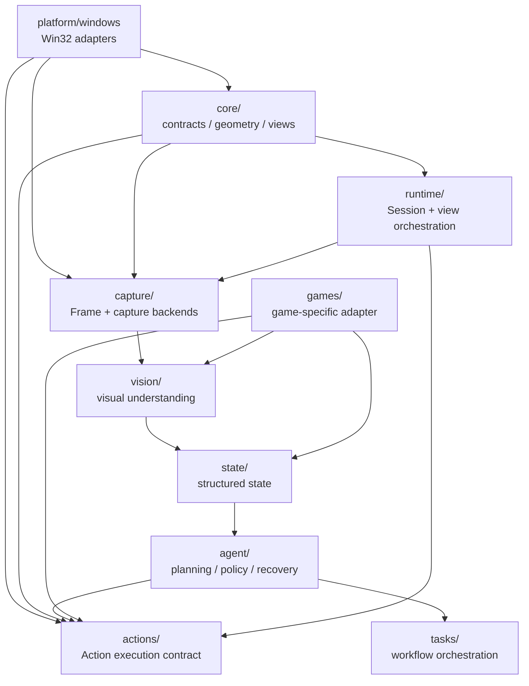

# game_helpers 架构总览

> 本文描述 `src/game_helpers` 的实际依赖边界。游戏是第一个应用场景，长期目标是可复用的 GUI Agent Core。

## 1. 整体架构



关键原则：**Core 是契约和基础模型，不是 Windows 实现的容器。** Windows API、输入投递和宿主 View 切换分别由 `platform/windows/` 与 `runtime/` 承担。

## 2. Agent 数据闭环

当前已经正式建立平台无关的数据协议：

```text
Capture
  ↓
FrameLike
  ↓
Observation
  ↓
GameState
  ↓
AgentDecision
  ↓
Action
  ↓
ActionResult
  ↓
VerificationResult
  └──────────────→ next Observation
```

对应实现集中在 `core/agent_protocol.py`：

| 数据对象 | 作用 |
|---|---|
| `FrameLike` | Capture 输出给上层所需的最小帧契约，避免 Core 依赖具体 Capture 实现 |
| `Observation` | 将一帧及其视觉/文本结果规范化为 Agent 输入 |
| `GameState` | 当前可消费的结构化游戏状态；继续复用 Core 通用状态模型 |
| `AgentDecision` | Planner/Agent 输出的动作序列、置信度和解释信息 |
| `Action` | 可执行的原子动作；已有 Core 契约 |
| `ActionResult` | 动作执行状态、耗时、错误和执行元数据 |
| `VerificationResult` | 动作后状态是否达到预期，以及用于恢复的原因/状态 |

这套协议刻意不携带 Win32、具体游戏类型或具体 AI SDK，后续可以让规则 Agent、LLM Agent、视觉模型 Agent 共享同一 Runtime 数据面。

## 3. 运行时闭环

```text
Capture
  ↓
Observation
  ↓
GameState
  ↓
Agent / Planner
  ↓
Action
  ↓
Actions Executor
  ↓
Platform Adapter
  ↓
Game
  └──────────────→ Capture
```

第一阶段先保证：

```text
Capture → Understand → Decide → Execute → Verify
```

## 4. 模块职责

| 模块 | 职责 | 状态 |
|---|---|---|
| `core/` | 通用数据契约、几何、GameView、Surface；Agent 数据协议 | 已建立 |
| `platform/windows/` | Win32 window / child / tab / desktop input / background input | 已迁移 |
| `capture/` | Screen / PrintWindow / WGC 等 Frame 获取 | 已有实现 |
| `actions/` | ActionExecutor 与动作契约 | 已有实现，Win32 细节已下沉 |
| `runtime/` | Session、View switching 等跨模块编排 | 第一阶段已建立 |
| `vision/` | 从 Frame 提取结构化视觉信息 | 待接入 Observation |
| `state/` | 保存/演进 Agent 可消费的结构化状态 | 待接入 GameState |
| `agent/` | 规划、策略、恢复、记忆 | 待接入 AgentDecision |
| `games/` | 第一款游戏的专属适配 | 待实现 |
| `tasks/` | Agent 工作流与高层任务 | 待 Agent 化 |

## 5. 依赖边界

```text
Capture ──→ Observation ──→ State ──→ Agent ──→ Action
                                                  ↓
                                             ActionResult
                                                  ↓
                                          VerificationResult
                                                  ↓
                                               Capture
```

实际边界：

1. `core/` 不依赖 `capture.models`、`actions`、`agent` 或具体游戏。
2. `core/agent_protocol.py` 只依赖 Core 自身模型和最小 `FrameLike` Protocol。
3. `capture/` 只负责采集，不解释画面。
4. `actions/` 负责执行，不决定策略；Win32 输入在 `platform/windows/`。
5. `runtime/` 可以组合 Core、Capture、Actions，但不是 Core 的一部分。
6. `vision/` 不直接执行输入；其输出应逐步归一到 `Observation`。
7. `state/` 不负责底层截图；其状态应逐步归一到 `GameState`。
8. `agent/` 不直接调用 Win32 API；其决策输出应逐步归一到 `AgentDecision`。
9. `games/<target_game>/` 可以依赖通用能力，但通用层不能反向依赖游戏。

## 6. 本轮实际落地

已完成 Agent 数据面第一版：

- 新增 `core/agent_protocol.py`
- 建立 `FrameLike → Observation` 的 Capture/Perception 边界
- 建立 `AgentDecision → Action → ActionResult` 的决策/执行边界
- 建立 `VerificationResult` 作为闭环验证与恢复入口
- 从 `core/__init__.py` 导出协议对象
- 新增 `tests/test_agent_protocol.py` 覆盖核心数据契约

## 7. 下一阶段

下一步重点不再是定义更多 DTO，而是把现有模块真正接上这条数据面：

1. Capture backend 输出 `Frame`，Runtime/Perception 生成 `Observation`。
2. Vision + Game Adapter 将 `Observation` 映射为 `GameState`。
3. Agent 根据 `GameState` 生成 `AgentDecision`。
4. Runtime 将 `Action` 交给 Actions Executor，产出 `ActionResult`。
5. Verification 根据新的 Observation/State 产出 `VerificationResult`。
6. 将失败验证接入 recovery/memory，再进入下一轮 Capture。

**游戏是第一个应用场景；GUI Agent Core 才是长期产品核心。**
