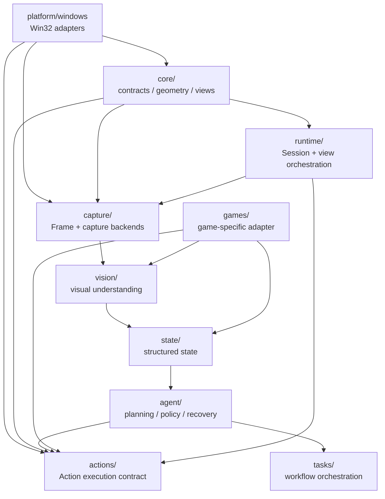

# game_helpers 架构总览

> 本文描述 `src/game_helpers` 的实际依赖边界。游戏是第一个应用场景，长期目标是可复用的 GUI Agent Core。

## 1. 整体架构



关键原则：**Core 是契约和基础模型，不是 Windows 实现的容器。** Windows API、输入投递和宿主 View 切换分别由 `platform/windows/` 与 `runtime/` 承担。

## 2. 运行时闭环

```text
Capture
  ↓
Vision
  ↓
GameState
  ↓
Agent / Planner
  ↓
Action
  ↓
Actions Executor
  ↓
Platform Adapter
  ↓
Game
  └──────────────→ Capture
```

第一阶段先保证：

```text
Capture → Understand → Decide → Execute → Verify
```

## 3. 模块职责

| 模块 | 职责 | 状态 |
|---|---|---|
| `core/` | Point / Rect / WindowInfo / GameView / Surface 等通用契约 | 核心基础层 |
| `platform/windows/` | Win32 window / child / tab / desktop input / background input | 已迁移 |
| `capture/` | Screen / PrintWindow / WGC 等 Frame 获取 | 已有实现 |
| `actions/` | ActionExecutor 与动作契约 | 已有实现，Win32 细节已下沉 |
| `runtime/` | Session、View switching 等跨模块编排 | 第一阶段已建立 |
| `vision/` | 从 Frame 提取结构化视觉信息 | 待实现 |
| `state/` | 保存 Agent 可消费的结构化状态 | 待实现 |
| `agent/` | 规划、策略、恢复、记忆 | 待实现 |
| `games/` | 第一款游戏的专属适配 | 待实现 |
| `tasks/` | Agent 工作流与高层任务 | 待 Agent 化 |

## 4. 依赖边界

```text
                         ┌──────────────┐
                         │    Agent     │
                         └──────┬───────┘
                                ↓
                              State
                                ↑
                              Vision
                                ↑
                             Capture
                                ↑
Platform ───────────────→ Core contracts
   │                         ↑
   └─────────────────────────┼──────────── Actions
                             ↑
                           Runtime
```

实际边界：

1. `core/` 不依赖 `capture.models`、`actions`、`agent` 或具体游戏。
2. `capture/` 只负责采集，不解释画面。
3. `actions/` 负责执行，不决定策略；Win32 输入在 `platform/windows/`。
4. `runtime/` 可以组合 Core、Capture、Actions，但不是 Core 的一部分。
5. `vision/` 不直接执行输入。
6. `state/` 不负责底层截图。
7. `agent/` 不直接调用 Win32 API。
8. `games/<target_game>/` 可以依赖通用能力，但通用层不能反向依赖游戏。

## 5. 本轮实际迁移

已完成第一阶段代码边界整理：

- Win32 window discovery → `platform/windows/window.py`
- Win32 child discovery → `platform/windows/children.py`
- Tab control / hosted surface switching → `platform/windows/tabs.py`
- Foreground input → `platform/windows/desktop_input.py`
- Background input → `platform/windows/input.py`
- Game view orchestration → `runtime/view_manager.py`
- Background game session → `runtime/session.py`
- `core/surface.py` 改为依赖最小 `FrameLike` 协议，不再运行时依赖 `capture.models.Frame`
- 原入口保留为 lazy compatibility facade，避免一次迁移破坏现有调用方

## 6. 下一阶段

下一步不是继续搬目录，而是建立稳定的 Agent 数据协议：

```text
Frame
  ↓
Observation
  ↓
GameState
  ↓
AgentDecision
  ↓
Action
  ↓
ActionResult
  ↓
Verification
```

然后在 `games/<target_game>/` 中接入第一款游戏，形成第一个真正的 AI 游戏 Agent 闭环。

**游戏是第一个应用场景；GUI Agent Core 才是长期产品核心。**
