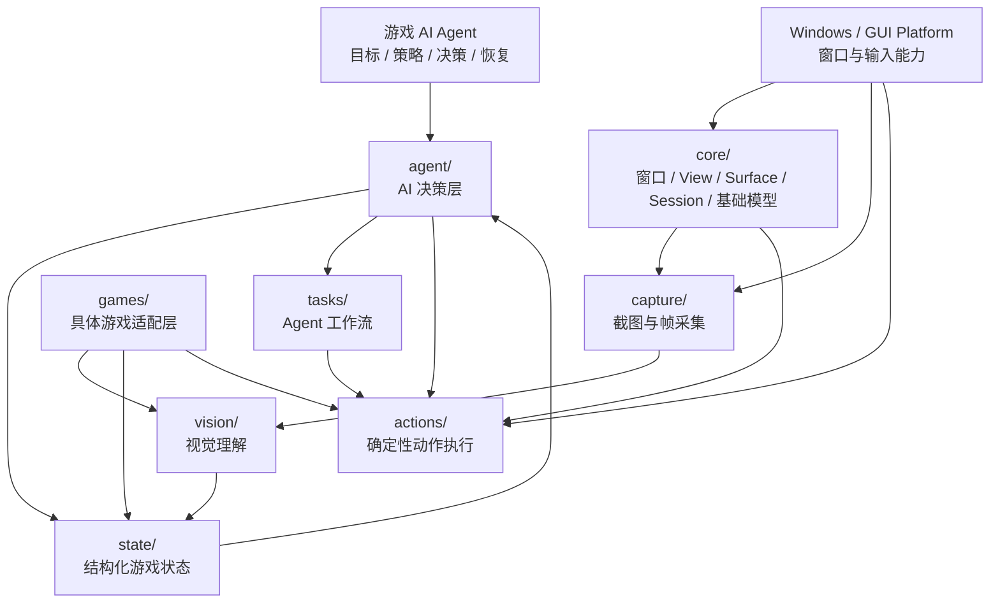

# game_helpers 架构总览

> 本文是 `src/game_helpers` 的架构导航图。目录级职责以各子目录 `README.md` 为准；本文关注模块之间的边界、数据流和依赖方向。

## 1. 整体架构



## 2. 运行时主链路

第一阶段的目标不是“脚本集合”，而是建立一个可验证的闭环：

```text
┌─────────────────────────────────────────────────────────────┐
│                      Game AI Agent                          │
│             Goal → Plan → Decide → Recover                 │
└───────────────────────────┬─────────────────────────────────┘
                            │ State / Action
                            ▼
┌─────────────────────────────────────────────────────────────┐
│                         Agent Runtime                       │
│                  agent/ + tasks/                            │
└───────────────┬─────────────────────────────┬──────────────┘
                │ State                       │ Action
                ▼                             ▼
┌─────────────────────────┐       ┌───────────────────────────┐
│        state/            │       │         actions/          │
│  GameState / State Flow  │       │  Mouse / Keyboard / Exec  │
└────────────┬────────────┘       └──────────────┬────────────┘
             ▲                                   │
             │                                   ▼
┌────────────┴────────────┐       ┌───────────────────────────┐
│        vision/          │       │          core/             │
│ Detection / OCR / Match │       │ Window / View / Session    │
└────────────▲────────────┘       └──────────────┬────────────┘
             │                                   │
┌────────────┴────────────┐                      │
│        capture/         │◄─────────────────────┘
│ Screen / Window / Frame │
└─────────────────────────┘
```

核心闭环：

```text
Capture
  ↓
Vision
  ↓
GameState
  ↓
Agent / Planner
  ↓
Action
  ↓
Verification
  ↓
新的 Frame / State
```

## 3. 模块职责

| 模块 | 核心问题 | 当前状态 | 依赖方向 |
|---|---|---|---|
| `core/` | 如何表示和管理 GUI 游戏运行环境？ | 已有核心实现 | 基础层 |
| `capture/` | 如何稳定获得游戏画面？ | 已有实现 | `core` / Platform |
| `actions/` | 如何可靠执行确定性输入？ | 已有实现 | `core` / Platform |
| `vision/` | 如何从画面提取信息？ | 架构阶段 | `capture` → `state` |
| `state/` | Agent 当前知道游戏处于什么状态？ | 架构阶段 | `vision` → `agent` |
| `agent/` | 下一步应该做什么？ | 架构阶段 | `state` → `actions` |
| `games/` | 目标游戏有哪些专属规则和感知？ | 架构阶段 | Core 能力之上的适配 |
| `tasks/` | 如何组织可执行工作流？ | 已有流程，待 Agent 化 | `agent` → `actions` |

详细职责：

- [`core/README.md`](core/README.md)：基础抽象
- [`capture/README.md`](capture/README.md)：输入采集
- [`actions/README.md`](actions/README.md)：动作执行
- [`vision/README.md`](vision/README.md)：视觉理解
- [`state/README.md`](state/README.md)：游戏状态
- [`agent/README.md`](agent/README.md)：AI 决策
- [`games/README.md`](games/README.md)：游戏适配
- [`tasks/README.md`](tasks/README.md)：工作流
- [`accounts/README.md`](accounts/README.md)：账号扩展

## 4. 依赖边界

### 推荐方向

```text
Platform
   ↓
core
   ↓
┌───────────────┬───────────────┐
│               │               │
capture       actions        runtime
│               │               │
▼               ▲               ▼
vision ───────→ state ───────→ agent
                                  │
                                  ▼
                               tasks
                                  │
                                  ▼
                               actions
```

### 边界原则

1. `core/` 不依赖具体游戏、Agent 策略或视觉算法。
2. `capture/` 负责获得画面，不负责解释画面。
3. `vision/` 负责解释画面，不直接执行输入。
4. `state/` 保存 Agent 可消费的结构化状态，不负责底层截图。
5. `agent/` 负责决策，不直接实现鼠标键盘细节。
6. `actions/` 负责确定性执行，不决定业务策略。
7. `games/` 承载第一款游戏的专属规则、感知和动作映射，不污染 Core。
8. `tasks/` 描述工作流，不重新实现底层 GUI 能力。

## 5. 当前代码现实与目标架构的关系

当前仓库并非所有层都已经实现。`core/`、`capture/`、`actions/` 和 `tasks/` 已有较多可运行代码；`vision/`、`state/`、`agent/`、`games/` 当前主要承担架构落点和后续迁移职责。

因此迁移策略应遵循：

```text
已有能力
  ↓
识别稳定抽象
  ↓
保持行为不变
  ↓
逐层迁移
  ↓
建立闭环
  ↓
再引入 Agent 决策
```

不要为了追求目录“看起来完整”而一次性重写已有能力。

## 6. 第一款游戏的落点

第一阶段只支持一个指定游戏，因此不需要过早设计复杂的多游戏插件体系。

推荐：

```text
src/game_helpers/games/
└── <target_game>/
    ├── README.md
    ├── perception.py
    ├── state.py
    ├── actions.py
    └── rules.py
```

游戏适配层可以依赖 Core 的通用能力，但 Core 不应反向依赖 `<target_game>`。

## 7. 设计目标

最终希望形成：

```text
                    ┌─────────────────────┐
                    │    Game AI Agent    │
                    └──────────┬──────────┘
                               │
                         structured state
                               │
                    ┌──────────▼──────────┐
                    │    GUI Agent Core   │
                    └──────────┬──────────┘
                               │
                    ┌──────────▼──────────┐
                    │ Windows GUI Runtime │
                    └─────────────────────┘
```

**游戏是第一个应用场景，GUI Agent Core 是长期可复用的核心。**
